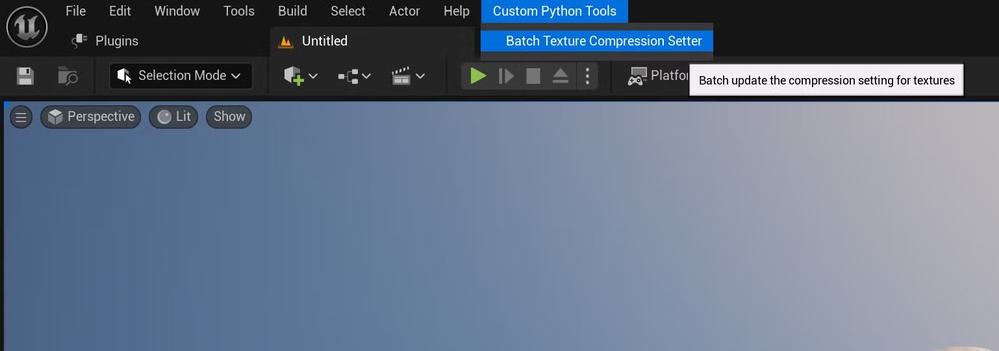
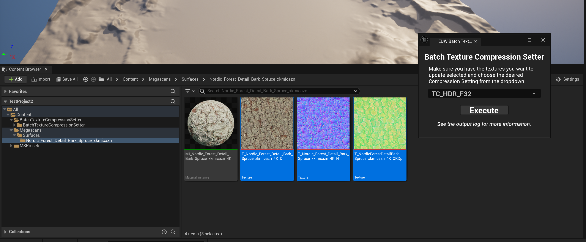
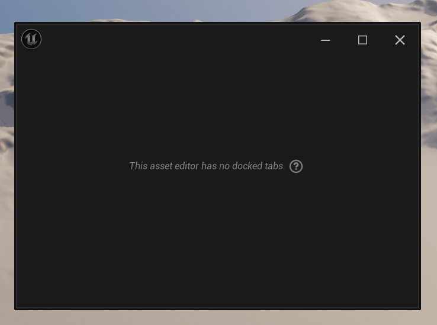

# BatchTextureCompressionSetter
## Info

- Unreal v5.3.2
- Dependencies:
    - Python Editor Script Plugin
    - Editor Scripting Utilities
- Unreal Engine plugin that allows you to change the Compression Setting for multiple textures at the same time. 

## Installation and Set Up

To install the plugin:

1. Make sure you have Git installed.  You can download it here: https://git-scm.com/
    
3. Open GitBash and navigate to your Unreal Engine 5.4 Plugins directory using the `cd` command.
   1. Example: `cd "C:\Program Files\Epic Games\UE_5.3\Engine\Plugins"`
      
4. Use the `git clone` command followed by `https://github.com/anonymous19456/BatchTextureCompressionSetter_UEPlugin` to clone the repository inside you Plugins folder.
   1. `git clone "https://github.com/anonymous19456/BatchTextureCompressionSetter_UEPlugin"`
      
6. To update the plugin use the `git pull` command after navigating to the repository using GitBash, which will pull the latest updates.
   1. Example: `git pull "C:\Program Files\Epic Games\UE_5.4\Engine\Plugins\BatchTextureCompressionSetter_UEPlugin"`

Enabling Dependencies:

1. Go to Plugins and enable the “Python Editor Script Plugin” and “Editor Scripting Utilities” if they are not already enabled.
    
    

2. Restart the editor.
    

## Using the Tool

1. Navigate to “Custom Python Tools > Batch Texture Compression Setter” at the top of the main window.  The tool’s window should open up when you click it.
    
    
    
2. Now select all the textures you’d like to modify in the Content Browser.  In the tool window that opened, make sure you specify the new Compression Setting for the selected Textures.
    
    
    
3. Press execute to update the textures, this may take awhile depending on how many textures you have and their quality.  I would advise against trying to do anything else until it finishes.  The output log will show this message when finished:
    1. `LogPython: Batch Texture Compression Setter - Batch Texture Compression Setter has run successfully.`

## Additional Notes

- Canceling the tool’s execution doesn’t undo changes it has already made, so be sure to manually undo them after cancelling.
- The tool automatically saves the affected Textures after updating them, so if you decide to undo the changes made by the tool, be sure to save after undoing before closing Unreal Engine.
- Making other changes while the tool is trying to run can mess with the list of Transactions and can potentially cause problems with Undo History.
- Trying to undo the tool’s changes while it is still running can also cause issues with the Undo History.
- For confirmation on whether the tool is finished see the Output log, check for this message:
    - `LogPython: Batch Texture Compression Setter - Batch Texture Compression Setter has run successfully.`
- The output log will list out the file paths of all modified Textures, in case you’re interested in confirming which Textures were updated.
- To see messages solely related to the tool in the Output log search `Batch Texture Compression Setter`  or `Log Python`
- If you open the editor and see a window like the one below, navigate to the tool in the menu hierarchy and it should open the tool properly.  This happens when you leave the tool open when closing the editor
    
    
